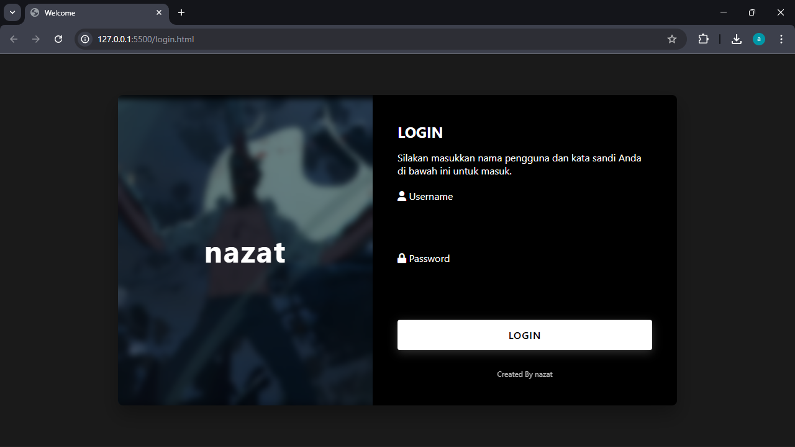

# Hotspot Mikrotik Custom Template

Template custom untuk halaman login Mikrotik Hotspot yang modern dan responsif.

# Preview Login


## 📁 Struktur File

- `login.html` - Halaman login utama
- `login.css` - Stylesheet untuk halaman login
- `logout.html` - Halaman logout
- `status.html` - Halaman status sesi
- `error.html` - Halaman error
- `redirect.html` - Halaman redirect
- `alogin.html` - Halaman login alternatif
- `rlogin.html` - Halaman login redirect
- `radvert.html` - Halaman advertisement
- `md5.js` - Library untuk enkripsi MD5
- `errors.txt` - File konfigurasi pesan error

## 🖼️ File Gambar

- `1.jpeg` - Background image untuk halaman logout
- `2.jpeg` - Background image untuk halaman login

## ✨ Fitur

✅ **Desain Modern** - UI yang clean dan profesional

✅ **Responsif** - Bekerja optimal di desktop dan mobile

✅ **Dark Theme** - Tema gelap yang eye-friendly

✅ **Animasi Smooth** - Transisi dan efek halus

✅ **Font Awesome Icons** - Icon yang konsisten

✅ **Google Fonts** - Typography yang elegan

## 🚀 Cara Installasi

### 1. Upload File ke Mikrotik

```bash
# Upload semua file ke direktori hotspot di Mikrotik
/file print
/file upload "login.html"
/file upload "login.css"
# ... dan seterusnya untuk semua file
```

### 2. Konfigurasi Mikrotik

```bash
# Set halaman login utama
/ip hotspot profile set [find default=yes] login.html=login.html

# Set halaman logout
/ip hotspot profile set [find default=yes] logout.html=logout.html

# Set halaman status
/ip hotspot profile set [find default=yes] status.html=status.html

# Set halaman error
/ip hotspot profile set [find default=yes] error.html=error.html

# Set file CSS
/ip hotspot profile set [find default=yes] css-file=login.css
```

### 3. Upload File melalui Winbox

1. Buka Winbox dan connect ke Mikrotik
2. Masuk ke menu "Files"
3. Upload semua file ke direktori root
4. Pastikan semua file memiliki permission yang tepat

## ⚙️ Konfigurasi Tambahan

### Custom Domain
```bash
/ip hotspot profile set [find default=yes] http-redirect=yes
/ip hotspot profile set [find default=yes] redirect-url="http://your-domain.com"
```

### SSL Certificate
```bash
/certificate import file-name=your-cert.pass
/certificate import file-name=your-key.key
/ip service set www-ssl certificate=your-cert.pass
```

## 🎨 Customisasi

### Mengubah Warna Theme
Edit file `login.css` dan ubah variabel CSS di bagian `:root`:

```css
:root {
    --primary-color: #your-color;
    --secondary-color: #your-color;
    --text-color: #your-color;
}
```

### Mengubah foto
Ganti file `1.jpeg` dan `2.jpeg` dengan gambar custom Anda

### Mengubah Logo
Edit file `login.html` dan `logout.html`:
```html
<div class="logo-text">NAMA_ANDA</div>
```

### Mengubah Footer Credit
Edit semua file HTML dan ubah link Instagram:
```html
<a href="https://www.instagram.com/username_anda">Created By YourName</a>
```

## 🔧 Troubleshooting

### Halaman Tidak Tampil
- Pastikan semua file sudah diupload
- Check permission file
- Restart service hotspot

### CSS Tidak Load
- Pastikan path CSS benar di HTML
- Check apakah file CSS terupload

### Gambar Tidak Muncul
- Pastikan file gambar ada di direktori
- Check permission file gambar

## 📱 Responsive Design

Template ini sudah dioptimalkan untuk:
- 📱 Mobile (max-width: 480px)
- 📟 Tablet (max-width: 768px)
- 💻 Desktop (min-width: 769px)

## 🛡️ Keamanan

- Menggunakan MD5 encryption untuk password
- Validasi input form
- Protection against XSS
- Secure cookie handling

## 📊 Fitur Login

- ✅ Username/password authentication
- ✅ Remember me functionality
- ✅ Session management
- ✅ Data usage tracking
- ✅ Time limit tracking
- ✅ MAC address binding

## 🌐 Browser Support

- Chrome 60+
- Firefox 55+
- Safari 12+
- Edge 79+

## 📝 Changelog

### v1.0
- Initial release
- Modern dark theme
- Responsive design
- Complete hotspot pages

## 👨‍💻 Developer

Dibuat oleh **nazat**  
Instagram: [@nxzxt_]

## 📄 License

MIT License - bebas untuk digunakan dan dimodifikasi.

## 🤝 Contributing

Silakan fork dan pull request untuk improvements.

## ⚠️ Disclaimer

Gunakan template ini untuk tujuan edukasi dan legal. Penulis tidak bertanggung jawab atas penyalahgunaan.

## 🎬 Cara Pakai & Tutorial Lengkap
Untuk melihat cara install dan konfigurasi step-by-step di Mikrotik, tonton video tutorial ini:
Link Video Tutorial ( COMING SOON )

---

**Happy Hotspotting!** 🚀
